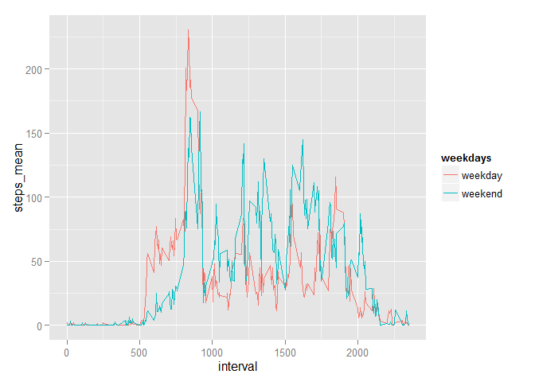

###Reproducible Research Peer Assessment 1: PA1_template.rmd
Nancy Chang


###Loading and preprocessing the data:

```r
unzip("./activity.zip", exdir = ".", overwrite = FALSE)
```

```
## Warning in unzip("./activity.zip", exdir = ".", overwrite = FALSE): not
## overwriting file './activity.csv
```

```r
activity <- read.csv("activity.csv", sep=",", stringsAsFactors = FALSE)
```

###What is mean total number of steps taken per day?
**1. Calculate the total number of steps taken per day.**

```r
library(dplyr)
```

```
## Warning: package 'dplyr' was built under R version 3.1.2
```

```
## 
## Attaching package: 'dplyr'
## 
## The following object is masked from 'package:stats':
## 
##     filter
## 
## The following objects are masked from 'package:base':
## 
##     intersect, setdiff, setequal, union
```

```r
Activity <- tbl_df(activity)
steps_day <- Activity %>% 
    group_by(date) %>% 
    summarise(total_steps_per_day = sum(steps)) %>% 
    print
```

```
## Source: local data frame [61 x 2]
## 
##          date total_steps_per_day
## 1  2012-10-01                  NA
## 2  2012-10-02                 126
## 3  2012-10-03               11352
## 4  2012-10-04               12116
## 5  2012-10-05               13294
## 6  2012-10-06               15420
## 7  2012-10-07               11015
## 8  2012-10-08                  NA
## 9  2012-10-09               12811
## 10 2012-10-10                9900
## ..        ...                 ...
```
**2. Make a histogram of the total number of steps taken each day.**

```r
steps_day$date <- as.Date(steps_day$date, format = "%Y-%m-%d")
```
Here is the histogram of the data

```r
hist(steps_day$date, breaks = "days", main= "Mean total steps taken per day", xlab="Date", ylab="total steps/per day", freq=TRUE)
```

 

**3. Calculate and report the mean and median of the total number of steps taken per day.**

```r
steps_mean <- Activity %>% 
         group_by(date) %>% 
         summarise(steps_mean = mean(steps), steps_median = median(steps)) %>% 
         print
```

```
## Source: local data frame [61 x 3]
## 
##          date steps_mean steps_median
## 1  2012-10-01         NA           NA
## 2  2012-10-02    0.43750            0
## 3  2012-10-03   39.41667            0
## 4  2012-10-04   42.06944            0
## 5  2012-10-05   46.15972            0
## 6  2012-10-06   53.54167            0
## 7  2012-10-07   38.24653            0
## 8  2012-10-08         NA           NA
## 9  2012-10-09   44.48264            0
## 10 2012-10-10   34.37500            0
## ..        ...        ...          ...
```

###What is the average daily activity pattern?
**1. Make a time series plot of the 5-minute interval (x-axis) and the average number of steps taken.**

```r
steps_int <- na.omit(Activity) %>% 
    group_by(interval) %>% 
    summarise(ave_steps = mean(steps))
plot(steps_int$interval, steps_int$ave_steps, type="l", ylab="average steps per interval", xlab= "5-min interval")
```

 

###Imputing missing values
**1. Calculate and report the total number of missing values in the dataset.**

```r
length(Activity$steps[Activity$steps =="NA"])
```

```
## [1] 2304
```
**2. Devise a strategy for filling in all of the missing values in the dataset.**

```r
Act <- Activity
Act$steps[is.na(Act$steps)] <- steps_int$ave_steps
```
**3. Create a new dataset that is equal to the original dataset but with the missing data filled in. And calculate and report the mean and median total number of steps taken per day.**

```r
Act_day <- group_by(Act, date)
Act_daystep <- Act_day %>% summarise(steps=mean(steps)) %>% print
```

```
## Source: local data frame [61 x 2]
## 
##          date    steps
## 1  2012-10-01 37.38260
## 2  2012-10-02  0.43750
## 3  2012-10-03 39.41667
## 4  2012-10-04 42.06944
## 5  2012-10-05 46.15972
## 6  2012-10-06 53.54167
## 7  2012-10-07 38.24653
## 8  2012-10-08 37.38260
## 9  2012-10-09 44.48264
## 10 2012-10-10 34.37500
## ..        ...      ...
```
**4. Make a histogram of the total number of steps taken each day.**
 

###Are there differences in activity patterns between weekdays and weekends?
**1. Create a new factor variable in the dataset with two levels - "weekday" and "weekend" indicating whether a given date is a weekday or weekend day.**

```r
Act$date <- as.Date(Act$date, format = "%Y-%m-%d")
Act_w <- mutate(Act, weekdays = as.character(weekdays(date, abbreviate = TRUE)))
b <- gsub("Mon|Tue|Wed|Thu|Fri", "weekday", Act_w$weekdays)
c <- gsub("Sun|Sat", "weekend", b)
Act_w$weekdays <- c
Act_weekday <- Act_w %>% 
    group_by(weekdays,interval) %>%
    summarize(steps_mean = mean(steps))%>%
    print
```

```
## Source: local data frame [576 x 3]
## Groups: weekdays
## 
##    weekdays interval steps_mean
## 1   weekday        0 2.25115304
## 2   weekday        5 0.44528302
## 3   weekday       10 0.17316562
## 4   weekday       15 0.19790356
## 5   weekday       20 0.09895178
## 6   weekday       25 1.59035639
## 7   weekday       30 0.69266247
## 8   weekday       35 1.13794549
## 9   weekday       40 0.00000000
## 10  weekday       45 1.79622642
## ..      ...      ...        ...
```
**2. Make a panel plot containing a time series plot of the 5-minute interval (x-axis) and the average number of steps taken.**
 

